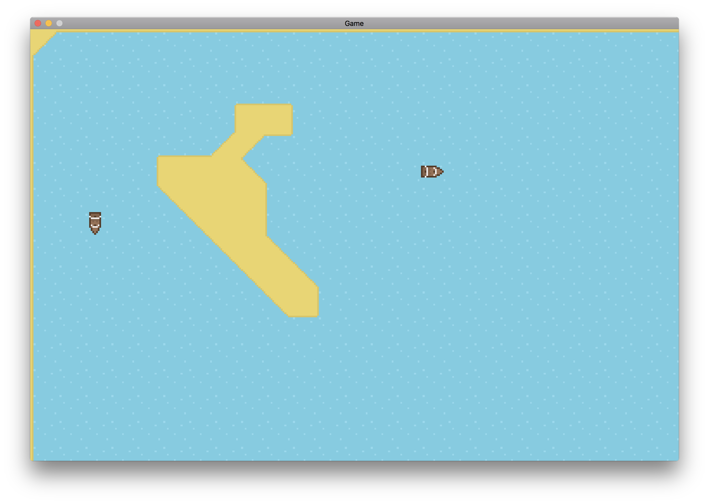

# Pieces of Seven

Pieces of Seven (or p7) is a multiplayer open world game written in Go, using SDL. It consists
of two parts, the *server* and the *client*. The server is intended to be used as its own
program, despite existing in the same codebase as the game/client.

It's in early development so it's definitely not stable, and it's not really much of a game yet.
However, it still has working multiplayer support, procedural world generation, and click-to-move
controls with pathfinding.



## Installation

First, look at [go-sdl2](https://github.com/veandco/go-sdl2/blob/master/README.md) for instructions
to install SDL on your operating system. Then, run the following command:

```
go get github.com/Zac-Garby/pieces-of-seven
```

## Hosting a server

To host a server, run this command:

```
go run $GOPATH/src/github.com/Zac-Garby/pieces-of-seven/server/main.go
```

It will then prompt you for the address you want to host on, which will default to `localhost:12358`.
The `localhost` part is implied though, even if you enter your own address, so you can just write
something like `:4200` which will host on `127.0.0.1:4200`.

Once you enter the address, the server will start and you can connect to it from a client.

## Connecting to a server

To connect to a server, run these commands:

```
cd $GOPATH/src/github.com/Zac-Garby/pieces-of-seven
go install
pieces-of-seven
```

This one's slightly different because the assets have to be visible in the current working directory.
Also, the use of `go install` is because just running `main.go` won't give the program access to
`scenes.go`, which it needs. This will be fixed soon.

These commands should open a window telling you to press `C`. It will ask you for address to connect
to, which defaults to `localhost:12358`. Press `RETURN` to join the specified server.

Once you're in a game, you can't really do much yet. You can click somewhere, and your ship will sail
to the tile you clicked. Go back to the main menu by pressing `ESC`.

## Problems

 - On macOS, the title bar is grey. This will be fixed in a future (hopefully soon) version of SDL.
    It's not my fault.
 
 - On macOS again, sometimes the window won't get focus when it starts up, and clicking on it
    doesn't seem to help. You have to click off the window and back on it again, which should work.

## Contributing

I think this repo should be quite fun to contribute to, since there's so much you could do. Have
a look at the issues. If there's something you want to do, **write a comment saying so**, so
your work doesn't overlap with anyone else's. Once you've decided what you're going to do, fork
the repo, make some changes and submit a pull request.
